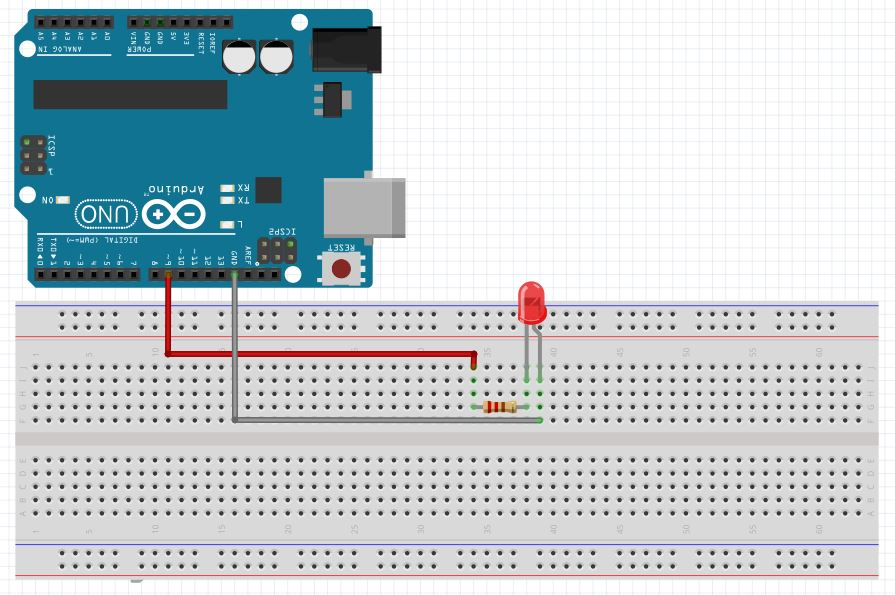

# Functions

Topics
* [I. Built-in functions](#i-builtin-functions)
* [II. Defining Functions](#ii-defining-functions)
* [III. Arguments](#iii-arguments)
* [IV. Returning Values](#iv-returning-values)

Exercises
* [Exercise 0](#ex0)
* [Exercise 1](#ex1)
* [Exercise 2](#ex2)
* [Exercise 3](#ex3)
* [Exercise 4](#ex4)

---
## I. Built-in functions

So far we've looked at the following built-in functions:

* [setup()](https://www.arduino.cc/en/Reference/Setup) - Every Arduino sketch must have a setup()- called one time at the beginning.
* [loop()](https://www.arduino.cc/en/Reference/Loop) - Every Arduino sketch must have a loop()- called over and over as long as the Arduino is plugged in.
* [digitalWrite()](https://www.arduino.cc/en/Reference/DigitalWrite)
* [delay()](https://www.arduino.cc/en/Reference/Delay)

We're going to look at another built in function: **analogWrite()**. Like digitalWrite(), analogWrite() can be used to power LEDs, but in this case, analogWrite() can *set a range of values between 0-255, not just ON/OFF,* making it possible to fade LEDs.

```c++
analogWrite([pin number], [value between 0 and 255]);
```

---

<a name="ex0"></a>
<pre>
<b>Exercise 0:</b>
Only ~PWM (pulse width modulation) digital pins can use the function analogWrite().
Which pins can fade LEDs?
</pre>

<a name="ex1"></a>
<pre>
<b>Exercise 1:</b>
Pin 13 is the only pin with a built-in resistor. If we use any other pin
to power LEDs (which we'll have to if we're doing to do an analogWrite()),
we have to use a breadboard and a resistor. The resistor limits current
and prevents the LED from burning out.

1. Set up the circuit below using:
    2 jumpers
    220Ω resistor
    LED
    breadboard
2. Make the LED:
    1) start off
    2) 1/3 max brightness
    3) 2/3 max brightness
    4) full brightness
    5) repeat!
</pre>



---

## II. Defining Functions

Arduino comes with many built-in functions that you can explore in the [reference](https://www.arduino.cc/en/Reference/). In addition to using these functions, we can also write our own.

As an example, we can **declare our own function, blink()**:

Functions make our code easier to read and helps to avoid code repetition.

```c++
// blink declaration
// "void" is the return type (nothing returned in this case)
void blink() {
    digitalWrite(ledPin, HIGH);   // turn the LED on
    delay(1000);                  // wait for a second
    digitalWrite(ledPin, LOW);    // turn the LED off by making the voltage LOW
    delay(1000);                  // wait for a second
}
```

**To call our function** we use the function name. The function will not be called by default; we have to call it in the setup() or loop():

```c++
int ledPin = 9;

void setup() {
  pinMode(ledPin, OUTPUT);
}

void loop() {
    blink();      // calling function here
}

void blink() {
    digitalWrite(ledPin, HIGH);   
    delay(1000);                  
    digitalWrite(ledPin, LOW);    
    delay(1000);                  
}
```

---

<a name="ex2"></a>
<pre>
<b>Exercise 2:</b>
1. Using the code you wrote in Exercise 1, create a function, <b>lightStep()</b>,
that lights up an LED in steps of increasing brightness.

2. Alternate between delaying 1 second and 1/2 second between calling lightStep().
</pre>


```c++
int ledPin = 9;

void setup() {
  pinMode(ledPin, OUTPUT);
}

void loop() {
  // calling function here
}

// declare your function here
```

---

## III. Arguments
Passing arguments to functions allows us reuse the code of a function but pass in different values. As an example, instead of delaying 1 second every time we call blink(), let's pass an argument to blink() so that we can set the delay to any arbitrary value.

**Step 1:** When we declare the function, we include *parameters* inside of the parentheses of the function header. A parameter tells our function what *type* of data the function should expect. Inside of our function definition we refer to the parameter:

```c++
// delayTime is a parameter
void blink(int delayTime) {
    digitalWrite(ledPin, HIGH);   
    delay(delayTime);                  
    digitalWrite(ledPin, LOW);    
    delay(delayTime);                                 
}
```

**Step 2:** When we call our function, we pass an *argument* - in this case, a number representing the delay time.

```c++
int ledPin = 9;

void setup() {
  pinMode(ledPin, OUTPUT);
}

void loop() {
  // call blink with arguments

  blink(500);     // 500 is an argument
  blink(800);     // 800 is an argument
  blink(200);     // 200 is an argument
}

// delayTime is a parameter
void blink(int delayTime) {
    digitalWrite(ledPin, HIGH);   
    delay(delayTime);                  
    digitalWrite(ledPin, LOW);    
    delay(delayTime);                                 
}
```

NOTE:
* A **parameter** is a variable in a function definition.
* An **argument** is the data you pass into the method's parameters.

---

<a name="ex3"></a>
<pre>
<b>Exercise 3:</b>
Write a function <b>setBrightness()</b> that takes two arguments:

1. The first is an integer between 0 and 100.
It sets the LED to a level of brightness between 255 (max on) to 0 (off).

Hint: do a little math.

2. The second integer sets the amount of time the LED delays at that brightness.
</pre>

```c++
int ledPin = 9;

void setup() {
  pinMode(ledPin, OUTPUT);
}

void loop() {
  // setBrightness() takes an argument between 0 and 100
  // and an argument representing the delay time
  setBrightness(0, 1000);
  setBrightness(50, 500);
  setBrightness(100, 2000);
}

// define setBrightness() here
```


## IV. Returning Values

So far we've only looked at functions that are "void." These functions execute code, but they do not *return* values. Now we're going to look at functions that do a calculation and *return* a value.

**Step 1.** Declare your function *with the data type* that your function will return. For example, to declare the function sum() that takes two values and returns their sum (an integer):

```c++
int sum(int a, int b) {
  return a + b;
}
```

**Step 2.** When we call sum(), we can set a variable equal to the function sum() because it returns a value:

```c++
int ledPin = 9;

void setup() {
  pinMode(ledPin, OUTPUT);
}

void loop() {

  int s1 = sum(500, 500);
  int s2 = sum(250, 250);

  digitalWrite(ledPin, HIGH);
  delay(s1);
  digitalWrite(ledPin, LOW);
  delay(s2);
}

int sum(int a, int b) {
  return a + b;
}
```

---

<a name="ex4"></a>
<pre>
<b>Exercise 4:</b>
 Write a function, square(), that takes a single argument-
 <b>a float</b> and returns the square of that number- <b>also a float</b>.

```c++
int ledPin = 9;

void setup() {
  pinMode(ledPin, OUTPUT);
}

void loop() {

  float square1 = square(10, 10);
  float square2 = square(20, 20);

  digitalWrite(ledPin, HIGH);
  delay(square1);
  digitalWrite(ledPin, LOW);
  delay(square2);
}

// square function goes here
```
