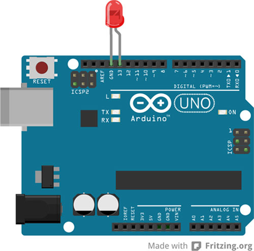

# 0. Getting Started

| Topics | Exercises | Circuit | Materials |
| --- | --- | --- | --- |
| [I. What is Arduino?](#i-what-is-Arduino) | | |
| [II. What can Arduinos do?](#ii-what-can-Arduino-do) | | |
| [III. Blink LED](#iii-blink-led) | [Exercise 0](#ex0) | Blinking LED | <ul><li>Arduino</li><li>USB cord</li><li>LED</li></ul> |

---

## I. What is Arduino?

From the [Arduino website](https://www.arduino.cc/):

  Arduino is an open-source electronics platform based on easy-to-use hardware and software. Arduino boards are able to read inputs - light on a sensor, a finger on a button, or a Twitter message - and turn it into an output - activating a motor, turning on an LED, publishing something online.

## II. What can Arduino do?

[](https://www.youtube.com/watch?v=QqiU-OalhiI)

## III. Blink LED
Let's begin by opening and uploading an example file that makes an LED blink: **File > Examples > Basics > Blink**.  Plug the long leg of the LED (the positive leg) into pin 13 and the short leg into ground:



#### Comments

A comment is code designed for humans, not computers. There are two ways to make comments: one-line and multi-line. Use the comments in the blink example file to identify where the LED is turned on and off.

```c++
// one line comment

/*

  multi-line
  comment

*/
```

---

<a name="ex0"></a>
<pre>
<b>Exercise 0:</b>
Can you modify the blink example so that the LED blinks faster? Slower?
</pre>
