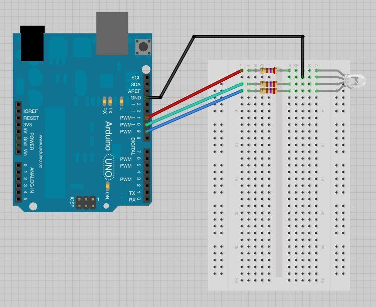

# 3. Functions

## 0. Overview

|  | Topics | Exercises | Circuit |
| --- | --- | --- | --- |
| I | [Defining Functions](#i-defining-functions) | [Exercise 0](#ex0) | RGB LED |
| II | [Parameters and Arguments](#ii-parameters-and-arguments)| - | RGB LED |
| III | [Multiple Arguments](#iii-multiple-arguments)| [Exercise 1](#ex1) | RGB LED |
| IV | [Returning Values](#iv-returning-values)| [Exercise 2](#ex2) | RGB LED |

## I. Defining Functions

Arduino comes with many built-in functions that you can explore in the [reference](https://www.arduino.cc/en/Reference/). In addition to using these functions, we can also write our own. We're going to continue using the RGB LED circuit from the previous chapter.

| Circuit | Materials | Diagram |
| --- | --- | --- |
| RGB LED | <ul><li>4 jumpers</li><li>3, 220Ω resistors</li><li>RGB LED</li><li>breadboard</li></ul> |  |

Let's write a function, **greenLight()**, that sets the LED to green.

1. We begin by **declaring our own function, "void greenLight() {"**:

2. Next we **call our function** using the function name followed by parentheses. The function will not be called by default; we have to call it in the setup() or loop():

```c++
int redPin = 11;
int greenPin = 10;
int bluePin = 9;

void setup() {
  // pinMode for each LED
  pinMode(redPin, OUTPUT);
  pinMode(greenPin, OUTPUT);
  pinMode(bluePin, OUTPUT);  
}

void loop() {
  greenLight();
}

void greenLight() {
  // makes the color green
  analogWrite(redPin, 0);
  analogWrite(greenPin, 255);
  analogWrite(bluePin, 0);  
}
```

**NOTE: Why functions?**
Functions make our code easier to read and helps to avoid code repetition.

---

<a name="ex0"></a>
<pre>
<b>Exercise 0:</b>
1. Using the RGB LED circuit, write a function, <b>whiteLight()</b> that makes the LED white.

2. Alternate between green and white light in the loop.
</pre>

```c++
int redPin = 11;
int greenPin = 10;
int bluePin = 9;

void setup() {
  // pinMode for each LED
  pinMode(redPin, OUTPUT);
  pinMode(greenPin, OUTPUT);
  pinMode(bluePin, OUTPUT);  
}

void loop() {
  // call functions here
}

void greenLight() {
  // makes the color green
  analogWrite(redPin, 0);
  analogWrite(greenPin, 255);
  analogWrite(bluePin, 0);  
}

// declare whiteLight() here

```

---

## II. Parameters and Arguments
Parameters in functions allows us reuse the code of a function but pass in different values.

For example, let's write a function, **goGreenies()**, that flashes between white and green light. The function has a parameter - flashTime - that determines how fast the colors flash.

```c++
int redPin = 11;
int greenPin = 10;
int bluePin = 9;

void setup() {
  // pinMode for each LED
  pinMode(redPin, OUTPUT);
  pinMode(greenPin, OUTPUT);
  pinMode(bluePin, OUTPUT);  
}

void loop() {
  goGreenies(100);
  goGreenies(500);
  goGreenies(1000);
}

void goGreenies(int flashTime) {  // one parameter = flashTime
  greenLight();
  delay(flashTime);
  whiteLight();
  delay(flashTime);
}

// greenLight() goes here
// defined in previous exercise

// whiteLight() goes here
// declared in previous exercise
```

**Step 1:** When we declare the function, we include *parameters* inside of the parentheses of the function header. A parameter tells our function what *type* of data the function should expect. Inside of our function definition we refer to the parameter.

  **NOTE**: In the previous example, *flashTime is the parameter*.

**Step 2:** When we call our function, we pass an *argument* - in this case, a number representing the delay time.

  **NOTE**: In the previous example, *100, 500, and 1000 are the arguments* passed to goGreenies().

NOTE:
* A **parameter** is a variable in a function definition.
* An **argument** is the data you pass into the method's parameters.


## III. Multiple Arguments

To pass multiple arguments, we separate the parameters with commas.

As an example, let's write a function, **setLedColor()**, for the RGB LED that has three parameters- one for the red value, green value, and blue value of the LED. Then the function sets the LED colors according to the arguments passed to the function.

```c++
int redPin = 11;
int greenPin = 10;
int bluePin = 9;

void setup() {
  // pinMode for each LED
  pinMode(redPin, OUTPUT);
  pinMode(greenPin, OUTPUT);
  pinMode(bluePin, OUTPUT);  
}

void loop() {
  setColor(0, 0, 255);  // blue
}

// declare function with multiple parameters
void setLedColor(int redC, int greenC, int blueC) {
  analogWrite(redPin, redC);
  analogWrite(greenPin, greenC);
  analogWrite(bluePin, blueC);  
}
```

---

<a name="ex1"></a>
<pre>
<b>Exercise 1:</b>
Write a function <b>stopLight()</b> that cycles through the stop light colors.
The function takes three arguments:

1. delay of the green light
2. delay of the yellow light
3. delay of red light

Call your function several times in the loop() with various delay values.
</pre>

```c++
// Exercise 1 - Stop light

int redPin = 11;
int greenPin = 10;
int bluePin = 9;

void setup() {
  // pinMode for each LED
  pinMode(redPin, OUTPUT);
  pinMode(greenPin, OUTPUT);
  pinMode(bluePin, OUTPUT);  
}

void loop() {
  // call your function here

}

// declare stopLight() here
```

## IV. Returning Values

So far we've only looked at functions that are "void." These functions execute code, but they do not *return* values. Now we're going to look at functions that do a calculation and *return* a value.

**Step 1.** Declare your function *with the data type* that your function will return. For example, to declare the function sum() that takes two values and returns their sum (an integer):

```c++
int sum(int a, int b) {
  return a + b;
}
```

**Step 2.** When we call sum(), we can set a variable equal to the function sum() because it returns a value:

```c++
// Example - sum() returns values

int redPin = 11;
int greenPin = 10;
int bluePin = 9;

void setup() {
  pinMode(redPin, OUTPUT);
  pinMode(greenPin, OUTPUT);
  pinMode(bluePin, OUTPUT);  
}

void loop() {
  int redVal = sum(10, 40);         // = 50
  int greenVal = sum(redVal, 50);   // = 100

  // equivalent to setLedColor(50, 100, 150);
  setLedColor(redVal, blueVal, sum(50, greenVal));
}

// Sum returns an integer
int sum(int a, int b) {
  return a + b;
}

void setLedColor(int redC, int greenC, int blueC) {
  analogWrite(redPin, redC);
  analogWrite(greenPin, greenC);
  analogWrite(bluePin, blueC);  
}
```

---

<a name="ex2"></a>
<pre>
<b>Exercise 2:</b>
 Write a function, square(), that takes a single argument-
 <b>a float</b> and returns the square of that number- <b>also a float</b>.
</pre>

```c++
// Example - sum() returns values

int redPin = 11;
int greenPin = 10;
int bluePin = 9;

void setup() {
  pinMode(redPin, OUTPUT);
  pinMode(greenPin, OUTPUT);
  pinMode(bluePin, OUTPUT);  
}

void loop() {
  float f1 = square(10);
  float f2 = square(5.5);
}

// square function goes here
```
