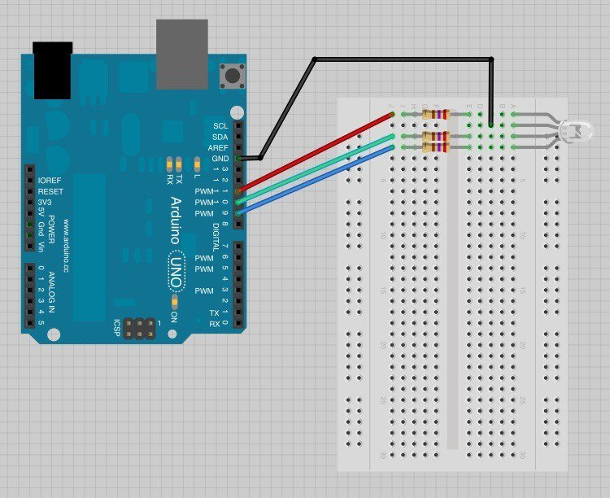

# Problem Set 0

Circuits covered in Problem Set 0:

| Circuit | Materials | Diagram |
| --- | --- | --- |
| blinking LED | <ul><li>Arduino</li><li>USB cord</li><li>LED</li></ul> |  |
| LED resistor | <ul><li>2 jumpers</li><li>220Ω resistor</li><li>LED</li><li>breadboard</li></ul> |  |
| RGB LED | <ul><li>4 jumpers</li><li>3, 220Ω resistors</li><li>RGB LED</li><li>breadboard</li></ul> |  |
| light sensor | <ul><li>photoresistor (light sensor)</li><li>3 jumpers wires</li><li>10KΩ resistor</li><li>LED</li><li>breadboard</li></ul> |  |
