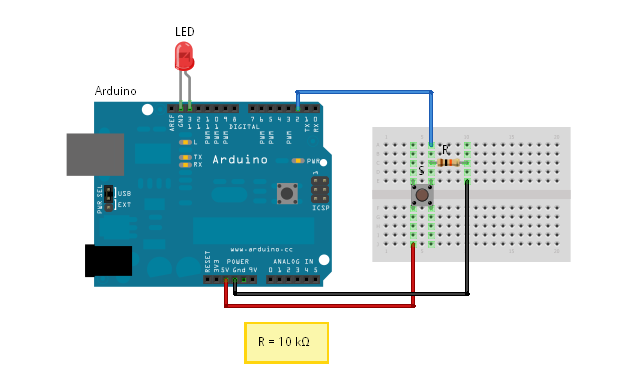

# 6. digitalRead()

## 0. Overview

|  | Topics | Exercises | Circuit |
| --- | --- | --- | --- |
| I | [Booleans](#i-booleans) | [Exercise 0](#ex0) | - |
| II | [Pushbutton](#ii-pushbutton) | [Exercise 1](#ex1) <br> [Exercise 2](#ex2) | pushbutton |
| III | [Latching Button](#iii-latching-button) | [Exercise 3](#ex3) | pushbutton |


## I. Booleans

So far we've examined the following data types:
* int - integers
* float - floating point (decimal) numbers
* String - text

Booleans are another data type that store **true or false**. We'll use a boolean, ledOn, to control whether the LED should turn on or off.

```c++
boolean ledOn = true;

int ledPin = 13;

void setup() {
  pinMode(ledPin, OUTPUT);
}

void loop() {
  if (ledOn) {
    digitalWrite(ledPin, HIGH);
  }
  else {
    digitalWrite(ledPin, LOW);
  }
}
```

---

<a name="ex0"></a>
<pre>
<b>Exercise 0:</b>
Using the code below, create another boolean, <b>blinking</b>, that is set to true. Use boolean operators
and if / else if / else structure to set up the following conditions:

1. If ledOn is true and blinkingOn is true, LED is blinking at a normal pace.
2. If ledOn is false and blinkingOn is true, led blinks once every 5 seconds.
3. If ledOn is true and blinkingOn is false, led is on.
3. If ledOn is false and blinkingOn is false, led is off.

Try adjusting the values of your booleans to make sure the program responds as you expect it should.
</pre>

```c++
boolean ledOn = true;
// your boolean here

int ledPin = 13;

void setup() {
  pinMode(ledPin, OUTPUT);
}

void loop() {
  // your conditional logic here
}
```

---

## II. Pushbutton
In this example, we're going to use [**digitalRead()**](https://www.arduino.cc/en/Reference/DigitalRead) to check whether a button is HIGH or LOW (i.e. on or off, 5 volts or 0 volts, true or false). Unlike analogRead(), digitalRead() doesn't return a range of values- it simply *returns* whether the pin is on or off.

Begin by setting up the circuit:

| Circuit | Materials | Diagram |
| --- | --- | --- |
| pushbutton | <ul><li>pushbutton</li><li>3 jumpers wires</li><li>10KΩ resistor</li><li>LED</li><li>breadboard</li></ul> |  |

**NOTE** the use of `boolean state` to store the value of whether the button is `HIGH` or `LOW` (true / false);

```c++
int ledPin = 13;
int buttonPin = 2;

void setup() {
    pinMode(ledPin, OUTPUT);
    pinMode(buttonPin, INPUT);    // NOTE THE BUTTON IS INPUT
}

void loop() {
    boolean state = digitalRead(buttonPin);
    if ( state == HIGH ) {
        digitalWrite(ledPin, HIGH);
    }
    else {
        digitalWrite(ledPin, LOW);
    }
}
```

---

<a name="ex1"></a>
<pre>
<b>Exercise 1:</b>
1. Print the button state to the Serial Monitor. What values does it print when the button is pressed/
released?
2. What do you recognize about the values `true`, `HIGH`, and `1` vs. `false`, `LOW`, and `0`?
</pre>


<a name="ex2"></a>
<pre>
<b>Exercise 2:</b>
Make the LED blink when the button is pressed.
</pre>

```c++
int ledPin = 13;
int buttonPin = 2;

void setup() {
    pinMode(ledPin, OUTPUT);
    pinMode(buttonPin, INPUT);    // note the button is INPUT
}

void loop() {
    boolean state = digitalRead(buttonPin);

    // if / else statement here
}
```

---

## III. Latching Button

Now the objective is to make a button that stays on when we first click it, and turns off when we click it again. In order to do so, we're going to need to:
1. store the previous state of the button in order to detect if the button's state has changed.
2. store the current state of the light in order to turn it on or off when the click occurs

We will also make use of the [boolean operator &&](https://www.arduino.cc/en/Reference/Boolean).

```c++
int ledPin = 13;
int buttonPin = 2;

boolean oldState = false;
boolean ledOn = false;

void setup() {
    pinMode(ledPin, OUTPUT);
    pinMode(buttonPin, INPUT);    // note the button is INPUT
}

void loop() {

    boolean newState = digitalRead(buttonPin);

    if (newState == HIGH && oldState == LOW) {

      // button has been clicked! Change LED state

      if (ledOn == true) {
        ledOn = false;  // the LED was on, but button has been clicked, so let's turn it off.
      }
      else {
        ledOn = true;   // LED was off, but the button has been clicked, so let's turn it on.
      }
    }

    // now that we've checked for a button state change,
    // let's update the oldState to the current state
    oldState = newState;

    setLED();
}

void setLED() {
  if (ledOn) {
    digitalWrite(ledPin, HIGH);
  }
  else {
    digitalWrite(ledPin, LOW);
  }
}
```

---

<a name="ex3"></a>
<pre>
<b>Exercise 3:</b>
To cement your understanding of the latching button, fill out the table below.

At what #s does the LED change state? Why is it necessary to save the oldState?
The ledOn state?
</pre>

| # | status | oldState | newState | ledOn |
| --- | ---- | ---- | ---- | ---- |
| 1 | before button is pressed | false | LOW | false |
| 2 | immediately when button pressed, 1st time |  |  |  |
| 3 | button still held down |  | HIGH | true |
| 4 | finger released 1st time | HIGH | LOW |  |
| 5 | immediately when button pressed, 2nd time |  | HIGH |  |
| 6 | button still held down, light is off | | LOW | false |
