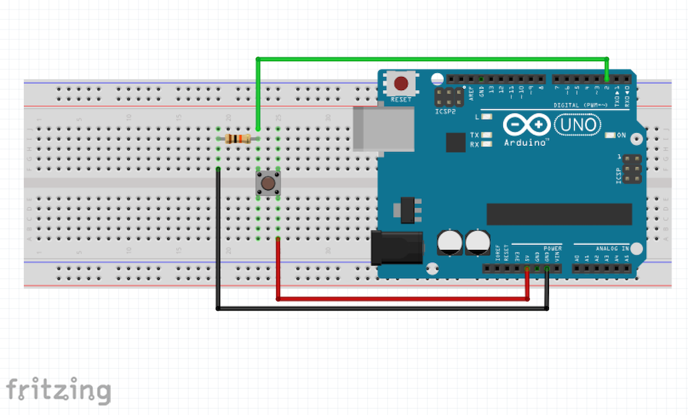

# 6. digitalRead()

## 0. Overview

|  | Topics | Exercises | Circuit |
| --- | --- | --- | --- |
| I | [I. Pushbutton](#i-pushbutton) | [Exercise 0](#ex0) | pushbutton |
| II | [II. Latching Button](#ii-latching-button) | [Exercise 1](#ex1) | pushbutton |


## I. Pushbutton
In this example, we're going to use [**digitalRead()**](https://www.arduino.cc/en/Reference/DigitalRead) to check whether a button is HIGH or LOW (i.e. on or off, 5 volts or 0 volts, true or false). Unlike analogRead(), digitalRead() doesn't return a range of values- it simply *returns* whether the pin is on or off.

Begin by setting up the circuit:

| Circuit | Materials | Diagram |
| --- | --- | --- |
| pushbutton | <ul><li>pushbutton</li><li>3 jumpers wires</li><li>10KΩ resistor</li><li>LED</li><li>breadboard</li></ul> | ![alt text] |


```c++
int ledPin = 13;
int buttonPin = 2;

void setup() {
    pinMode(ledPin, OUTPUT);
    pinMode(buttonPin, INPUT);    // NOTE THE BUTTON IS INPUT
}

void loop() {
    boolean state = digitalRead(buttonPin);
    if ( state == HIGH ) {
        digitalWrite(ledPin, HIGH);
    }
    else {
        digitalWrite(ledPin, LOW);
    }
}
```

---

<a name="ex0"></a>
<pre>
<b>Exercise 0:</b>
Write a function <b>timer()</b> that takes an argument and keeps an LED
on for the amount of time passed to the function.

Call timer() <b>when a button is pressed</b>.
</pre>

```c++
int ledPin = 13;
int buttonPin = 2;

void setup() {
    pinMode(ledPin, OUTPUT);
    pinMode(buttonPin, INPUT);    // note the button is INPUT
}

void loop() {
    boolean state = digitalRead(buttonPin);

    // if else statement here
}

// define timer() here
```

---

## II. Latching Button

Now the objective is to make a button that stays on when we first click it, and turns off when we click it again. In order to do so, we're going to need to:
1. store the previous state of the button in order to detect if the button's state has changed.
2. store the current state of the light in order to turn it on or off when the click occurs

We will also make use of the [boolean operator &&](https://www.arduino.cc/en/Reference/Boolean).

```c++
int ledPin = 13;
int buttonPin = 2;

boolean oldState = false;
boolean ledOn = false;

void setup() {
    pinMode(ledPin, OUTPUT);
    pinMode(buttonPin, INPUT);    // note the button is INPUT
}

void loop() {

    boolean newState = digitalRead(buttonPin);

    if (newState == HIGH && oldState == LOW) {

      // button has been clicked!

      if (ledOn) {
        // the LED was on, but button has been clicked, so
        // let's turn it off.
        ledOn = false;
      }
      else {
        // LED was off, but the button has been clicked, so
        // let's turn it on.
        ledOn = true;
      }
    }

    // now that we've checked for a button state change,
    // let's update the oldState to the current state
    oldState = newState;

    // finally, let's set the LED
    if (ledOn) {
      digitalWrite(ledPin, HIGH);
    }
    else {
      digitalWrite(ledPin, LOW);
    }
}
```

<a name="ex1"></a>
<pre>
<b>Exercise 1:</b>
To cement your understanding of the latching button, fill out the table below.

At what #s does the LED change state? Why is it necessary to save the oldState?
The ledOn state?
</pre>

| # | status | oldState | newState | ledOn |
| --- | ---- | ---- | ---- | ---- |
| 1 | before button is pressed | false | LOW | false |
| 2 | immediately when button pressed, 1st time |  |  |  |
| 3 | button still held down |  | HIGH | true |
| 4 | finger released 1st time | HIGH | LOW |  |
| 5 | immediately when button pressed, 2nd time |  | HIGH |  |
| 6 | button still held down, light is off | | LOW | false |
