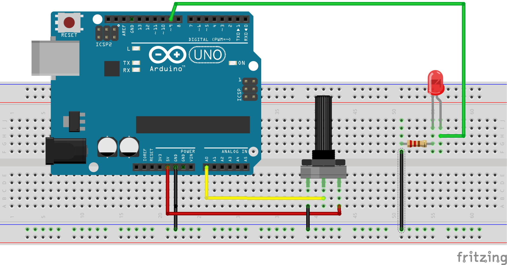
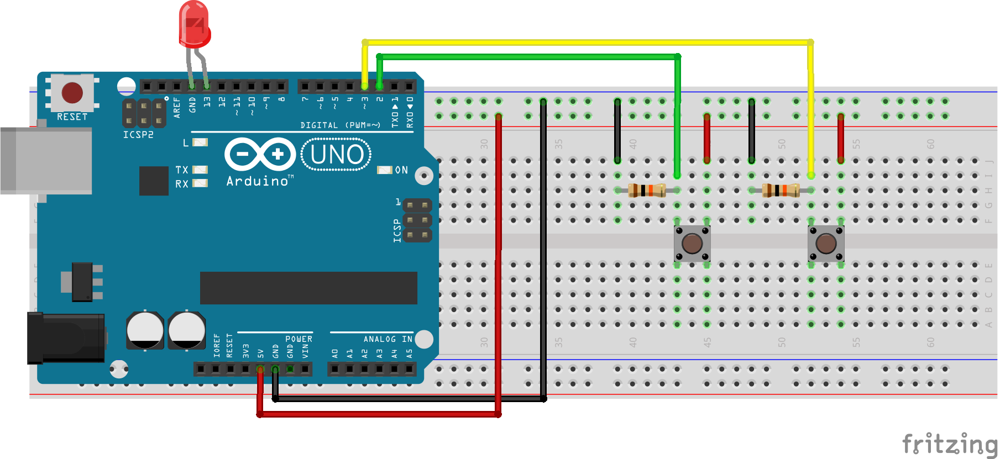

# Problem Set 1. conditionals

Problem sets should be completed **individually**, but *if you have questions, don't hesitate to ask* for help. Problems sets are meant to cement your understanding of Arduino concepts.

**BEFORE BEGINNING ASSIGNMENT**

1. Copy the code [in this template](../templates/ps1_template.md) into a new Arduino project.
2. Put all problem set answers into this Arduino sketch
3. *To submit assignment*, email this fleshed-out template to Ms. deBB

---

**(0)** Setup the circuit below with a potentiometer (a variable resistor / knob whose resistance increases/decreases as the knob turns).

| Circuit | Materials | Diagram |
| --- | --- | --- |
| pot & LED | <ul><li>~6 jumpers</li><li>220Ω resistor</li><li>LED</li><li>10KΩ pot</li><li>breadboard</li></ul> |  |

Fill out the following function, **checkPot()** so that if:
* pot reading is less than or equal to 900, set the LED brightness to the appropriate scale.
  * remember, the max val of analogWrite() is 255
  * Hint: check out the [map() function](https://www.arduino.cc/en/Reference/Map)
* pot is over 900, blink the LED.

```c++
int ledPin = 9;
int piezoPin = A0;

void setup() {
  pinMode(ledPin, OUTPUT);
  pinMode(piezoPin, INPUT);
}

void draw() {
  checkPot();
}

void checkPot() {
  // your code here
}

void blinky() {
  digitalWrite(ledPin, HIGH);
  delay(1000);
  digitalWrite(ledPin, LOW);
  delay(1000);
}
```

**(1)** Create the circuit below with two pushbuttons.

| Circuit | Materials | Diagram |
| --- | --- | --- |
| 2 pushbuttons | <ul><li>~8 jumpers</li><li>2, 10KΩ resistors</li><li>LED</li><li>2 pushbuttons</li><li>breadboard</li></ul> |  |

Write a function, **checkTwoButtons()**. Use conditional logic and booleans to:  

1. If the first button is pressed, light goes on and stays on
2. If the second button is pressed, light goes off and stays off
3. While both buttons are pressed, the light blinks.

Hint: Check out [compound boolean logic](https://www.arduino.cc/en/Reference/Boolean).


```c++
int ledPin = 13;
int buttonPin1 = 2;
int buttonPin2 = 3;

// any other variables go here

void setup() {
    pinMode(ledPin, OUTPUT);
    pinMode(buttonPin1, INPUT);
    pinMode(buttonPin2, INPUT);   
}

void loop() {
    checkTwoButtons();
}

void checkTwoButtons() {
  // your code here
}

void blinky() {
  digitalWrite(ledPin, HIGH);
  delay(1000);
  digitalWrite(ledPin, LOW);
  delay(1000);
}
```

**(2)** Write a function, ledMode(), that advances to another light mode if a pushbutton is pressed. The light modes are:

1. off
2. on
3. blinking

Hint: Review the button latching example.

```c++
int ledPin = 13;
int buttonPin1 = 2;

// any other variables go here

void setup() {
    pinMode(ledPin, OUTPUT);
    pinMode(buttonPin1, INPUT);
}

void loop() {
    ledMode();
}

void ledMode() {
  // your code here
}

void blinky() {
  digitalWrite(ledPin, HIGH);
  delay(1000);
  digitalWrite(ledPin, LOW);
  delay(1000);
}
```
