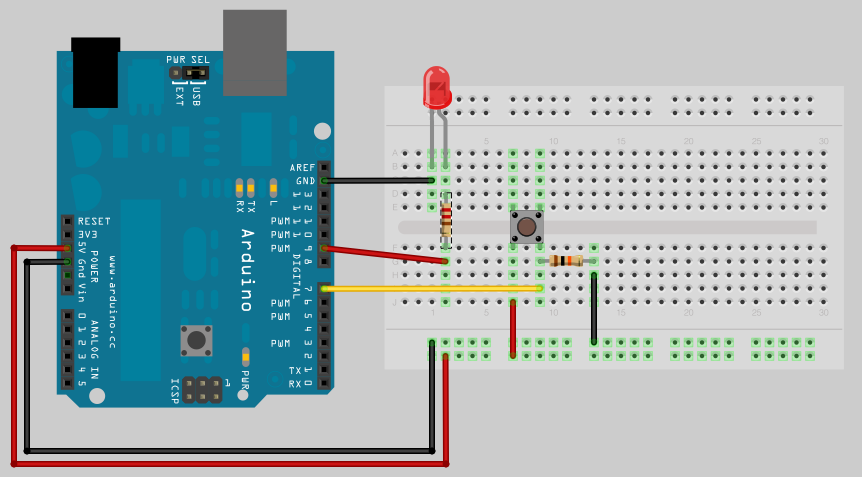

# 7. Loops

## 0. Overview

|  | Topics | Exercises | Circuit |
| --- | --- | --- | --- |
| I | [for loop](#i-for-loop) | [Exercise 0](#ex0) <br>[Exercise 1](#ex1)   | analogWrite() LED |
| II | [While Loops](#ii-while-loops) | [Exercise 2](#ex2)  | analogWrite() LED |


## I. for loop

In this section we're going to use a control structure known as a [**for** loop](https://www.arduino.cc/en/Reference/For). For loops help us iterate/ repeat code for a certain number of cycles.


As an example, let's print the the numbers from 0 to 9 to the Serial Monitor:

```javascript
void setup() {
  Serial.begin(9600);
}

void loop() {
  for (int i = 0; i < 10; i++) {
    Serial.println(i);
  }
  delay(1000);
}
```

Or to only print the even numbers, we can increment i by 2 each time (i+=2):

```javascript
void setup() {
  Serial.begin(9600);
}

void loop() {
  for (int i = 0; i < 10; i+=2) {
    Serial.println(i);
  }
  delay(1000);
}
```

---

<a name="ex0"></a>
<pre>
<b>Exercise 0:</b>
How do we use a for loop to print multiples of ten from -100 to 100?

E.g.: -100, -90, ..., 0, 10, ... , 100
</pre>

---

Let's do something more interesting. Begin by setting up a circuit with an LED attached to a pin that can do analogWrites.

| Circuit | Materials | Diagram |
| --- | --- | --- |
| analogWrite() LED | <ul><li>2 jumpers</li><li>220Ω resistor</li><li>LED</li><li>breadboard</li></ul> |  |

Let's use a for loop to make an LED fade:

```c++
int ledPin = 9;

void setup() {
  pinMode(ledPin, OUTPUT);
}

void loop() {
  fadeIn();
}

void fadeIn() {
  for (int i = 0; i < 255; i++) {
    analogWrite(ledPin, i);
    delay(10);
  }
}
```

---

<a name="ex1"></a>
<pre>
<b>Exercise 1:</b>
In the example above, how can we write a function, <b>fadeOut()</b>, that causes the LED to fade out rather than in?
</pre>

---

## II. While Loops

While loops are like for loops in that they repeat a block of code. The difference is that while loops *repeat as long as a given condition is true* rather than repeating incrementally over a given range.

For example,

```c++
int var = 0;
while(var < 200){
  // do something repetitive 200 times
  var++;
}
```

Let's use a while loop to pulse the LED (fade in and out) as long as a button is pressed. Begin by setting up the circuit:

| Circuit | Materials | Diagram |
| --- | --- | --- |
| analogWrite() LED, button | <ul><li>~7 jumpers</li><li>220Ω resistor</li><li>10KΩ resistor</li><li>LED</li><li>pushbutton</li><li>breadboard</li></ul> |  |


```c++
int ledPin = 9;
int buttonPin = 7;

void setup() {
  pinMode(ledPin, OUTPUT);
  pinMode(buttonPin, INPUT);
}

void loop() {
  while(digitalRead(buttonPin) == HIGH) {
    fadeIn();
    fadeOut();
  }
}

void fadeIn() {
  for (int i = 0; i < 255; i++) {
    analogWrite(ledPin, i);
    delay(10);
  }
}

// fade out declared here
```

---

<a name="ex2"></a>
<pre>
<b>Exercise 2:</b>
1. How can we modify the code above to immediately turn off the LED when the finger is released, but 
preserve that brightness level and <em>resume</em> at that brightness when the button is re-pressed.

2. If the LED has faded in and out a total of 3 times, immediately turn off the LED, no matter whether 
the pushbutton is pressed or not.

Hint1: Nix the for loops. Create some global variables.
Hint2: This is hard!
</pre>
